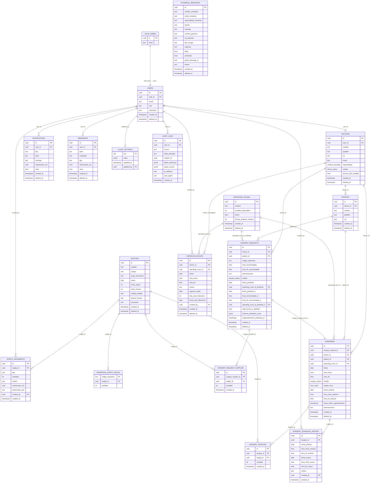

# Diagrama Entidad-Relación (ERD)

## Notas del diseño

- **Soft delete**: la mayoría de tablas tienen `deleted_at` en lugar de borrado físico. Las consultas del frontend filtran con `.is('deleted_at', null)`.
- **Relación 1:1 surgery_request → surgery**: una solicitud aceptada genera exactamente una cirugía; el campo `surgery_request_id` en `surgeries` tiene restricción `UNIQUE`.
- **Insumos en dos etapas**: los insumos se asocian primero a la solicitud (`surgery_request_supplies`) y luego se copian a la cirugía (`surgery_supplies`) al programarla via RPC.
- **Packs de operación** (`operation_supply_packs`): definen los insumos estándar por código de operación. `cantidad = 0` indica insumo opcional; `> 0` se auto-agrega al crear la solicitud.
- **Bloqueos con auto-liberación**: `schedule_blocks` soporta `vigencia_hasta` y `dias_auto_liberacion` para bloqueos temporales (ej. vacaciones). La RPC `liberar_bloqueos_expirados` los limpia.
- **Auditoría automática**: `audit_logs` se llena mediante triggers PostgreSQL en todas las tablas principales — no requiere lógica en el frontend.
